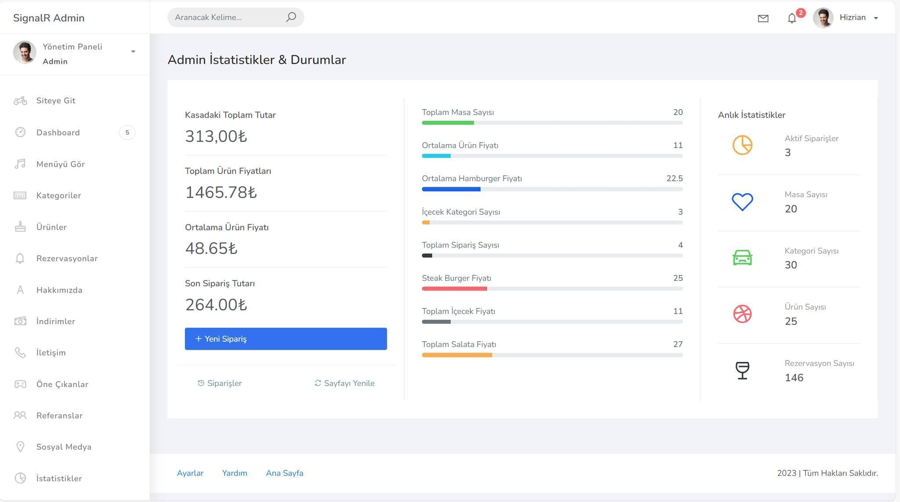
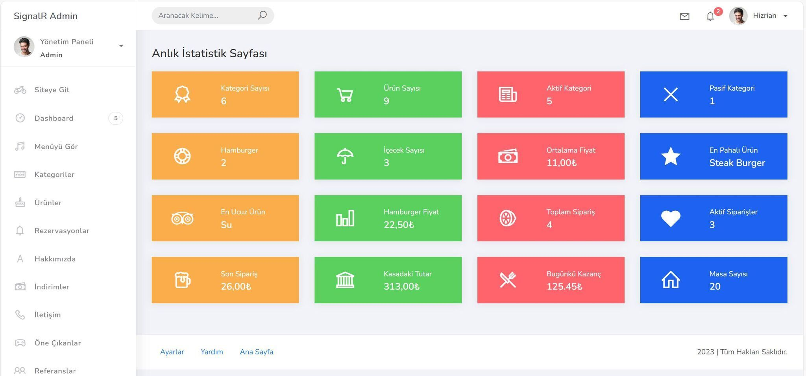
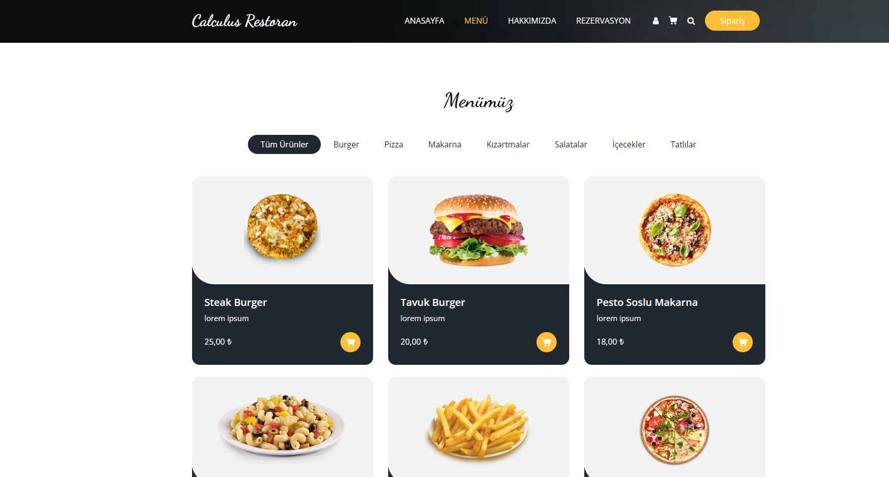

Bir restoranın anlık sipariş aldığı, müşteriler tarafından QR kod ile
sipariş verilebildiği, anlık bildirim, anlık mesajlaşma, anlık
istatistik gibi gerçek zamanlı verileri tutan bir kurguya sahip.\
\
Gerçek zamanlı veri sistemi için SignalR kullanıldı.\
\
Solidi ezmemeye, Clean Code ilkelerine bağlı kalmaya çalıştım.\
\
Temiz kod yazabilmek adına bolca ViewComponent kullanıp
sürdürülebilirliği arttırdım.\
\
Veri tabanı olarak MSSQL\'e yer verdik.\
\
Güvenlik işlemlerinde Identity kullandım.

Kullandığım tüm teknolojiler

-   Asp.Net Core 8.0

-   Asp.Net Web API

-   MSSQL

-   Entity Framework Code First

-   SignalR

-   MailKit

-   AutoMapper

-   Html

-   Css

-   JavaScript

Özellikler

-   Müsaitlik durumuna göre rezervasyon yapma

-   Admin tarafında anlık masa durumları görüntüleme

-   Anlık rezervasyonyon bilgilerini görüntüleme

-   Anlık Bildirimler Ürünlerin detaylarını görüntüleme\[\](url)

-   MSSQL ilişkili tablolar

-   Admin Paneli

-   İstatistikler

-   Mail Gönderme

